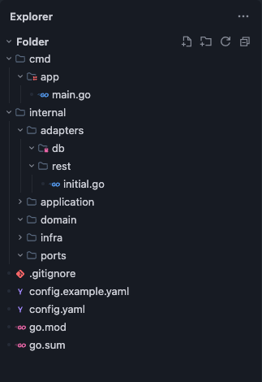
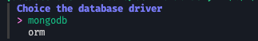

# liquor


Liquor is a web development framework built with Golang, designed to simplify the implementation of web projects. It is primarily focused on backend development and leverages several libraries specifically tailored for web development.


- [Installation](#install-cli)
- [Usage](#usage)
    - [Create a new project](#create-a-new-project)
    - [Create a usecase](#create-a-usecase)
    - [Create a repository](#create-repository)
    - [Create a rest api](#create-rest-api)
- Modules
    - [firebase](#firebase)
    - [redis](#redis)

## Install CLI

```bash
go install github.com/go-liquor/liquor/v3@latest
```

## Usage

### Create a new project

```bash
liquor create project --name <APP_NAME> --module <PACKAGE_NAME>
```

When you create a new project, it will follow the structure below:



- `cmd/app`: Contains the application’s entry point, including the main.go file and dependency injection setup.
- `internal/adapters`: Includes the adapters that integrate the application with external systems.
    - `db`: Contains the repository implementations and data models.
    - `rest`: Contains the HTTP API route implementations.
- `application`: Contains the use case logic.
- `domain`: Contains the core domain entities.
- `ports`: Defines the application interfaces.
- `config.example.yaml`: Example configuration file for reference.
- `config.yaml`: Project configuration file (should not be committed to Git).


### Create a usecase

```
liquor create usecase --name <name>
```

With this command, we will create a use case for your application along with its interface definition.

```go
// internal/ports/users_usecase.go
package ports

type UsersService interface {
}
```

```go
// internal/application/users_usecase.go
package application

import (
    "go.uber.org/zap"
    "gitlab.com/bitgator.io/clinichub.io/users/internal/ports"
)

type UsersService struct {
    logger *zap.Logger
}

func NewUsersService(logger *zap.Logger) ports.UsersService {
    return &UsersService{
        logger: logger,
    }
}
```

You need register usecase in `cmd/app/main.go`

```go
package main

import (
	"github.com/go-liquor/liquor/v3/app"
	"github.com/example/users/internal/adapters/rest"
    "github.com/example/users/internal/application"
)

func main() {
	app.New(
		app.WithRestApi(rest.NewRestApi),
        // register here
        app.WithService(application.NewUsersService),
	)
}
```

### Create repository

```
liquor create repository --name <name>
```

When creating a repository, you can choose which database driver to use.



```go
// internal/adapters/db/users_repository.go
package db

import (
    "go.mongodb.org/mongo-driver/v2/mongo"
    "gitlab.com/bitgator.io/clinichub.io/users/internal/ports"
)

type UsersRepository struct {
    db *mongo.Database
}

// NewUsersRepository create instance to ports.UsersRepository
func NewUsersRepository(db *mongo.Database) ports.UsersRepository {
    return &UsersRepository{
        db: db,
    }
}
```

```go
// internal/ports/users_repositoy.go
package ports

type UsersRepository interface {
}
```

You need register repository in `cmd/app/main.go`

```go
package main

import (
	"github.com/go-liquor/liquor/v3/app"
	"github.com/example/users/internal/adapters/rest"
    "github.com/example/users/internal/adapters/db"
)

func main() {
	app.New(
		app.WithRestApi(rest.NewRestApi),
        // register here
        app.WithRepository(db.NewUsersRepository),
	)
}
```

### Create Rest Api

```
liquor create rest --name <name> --group /<group>
```

```go
package rest

import (
	"net/http"

	"github.com/go-liquor/liquor/v3/app/adapters/rest"
)

type UsersApi struct {
}

func NewUsersApi() rest.Api {
	return &UsersApi{}
}

func (s *UsersApi) Routes(r *rest.Route) {
	group := r.Group("/users")
	{
		group.Get("/", func(r *rest.Request) {
			r.Status(http.StatusOK)
		})
	}
}
```

You need register restApi in `cmd/app/main.go`

```go
package main

import (
	"github.com/go-liquor/liquor/v3/app"
	"github.com/example/users/internal/adapters/rest"
    "github.com/example/users/internal/adapters/db"
)

func main() {
	app.New(
		app.WithRestApi(rest.NewRestApi),
        // register here
        app.WithRestApi(rest.NewUsersApi),
	)
}
```

## Modules

### firebase

To enable Firebase in your project, simply add the path to the `firebase.json` file in your configuration file.

```yaml
# config.yaml (or /etc/secrets/config.yaml)
# configure here
firebase:
    configFile: firebase.json
```

### redis

To enable Redis Client in your project, simply add redis configuration in your configuration file (`config.yaml`).

```yaml
# config.yaml (or /etc/secrets/config.yaml)
# configure here
redis:
    addr: localhost:6379
    passsword: "" # set this if have password
```
